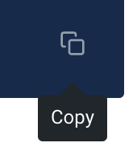

# Install Akash

The software to run **Akash** and the command-line client used to interact with them are all distributed in the `akash`application. The `akash` command is used to run the Akash Network.

Select a tab below to view instructions for MacOS, Linux, or compiling from source.



## MacOS

Before you install Akash, you will need to install the **XCode Command Line Tools**, and also we recommend using **Homebrew** to install Akash.

### 1. Install XCode:

You will need to install Apple's XCode Command Line Tools. Open Terminal on your Mac.  Click the copy icon in the code box below and paste the command on your Terminal prompt



```text
xcode-select --install
```

Installing XCode may take a while. Go grab a cup of coffee.

### 2. Install Homebrew:

If you do not have Homebrew, you can install Homebrew using:

```text
/bin/bash -c "$(curl -fsSL https://raw.githubusercontent.com/Homebrew/install/HEAD/install.sh)"
```

Install `akash` using homebrew:

```text
echo 'eval "$(/opt/homebrew/bin/brew shellenv)"' >> /Users/colinlowenberg/.zprofile
eval "$(/opt/homebrew/bin/brew shellenv)"
brew tap ovrclk/tap
brew install akash
brew link akash --force
```

Once installed, verify the installation by running `akash version`

```text
akash version
```

Congrats, now it's time to[ create your wallet.](wallet.md)



## Linux

Download the archive for your system from the [release page](https://github.com/ovrclk/akash/releases), extract it, and install the `akash` binary into your path.

#### GoDownloader

Alternatively, install the latest version via [`godownloader`](https://github.com/goreleaser/godownloader) First, configure the version of the Akash Network `AKASH_VERSION`as a shell variable in your terminal:

```bash
# configure akash version
AKASH_VERSION="$(curl -s "https://raw.githubusercontent.com/ovrclk/net/master/mainnet/version.txt")"

# install akash 
curl https://raw.githubusercontent.com/ovrclk/akash/master/godownloader.sh | sh -s -- "v$AKASH_VERSION"
```

The final step is to make sure that the akash binaries are available in your shell `PATH`. [This page](https://stackoverflow.com/questions/14637979/how-to-permanently-set-path-on-linux-unix) contains instructions for setting the PATH on Linux.



## Source

Installing Akash suite from source

```text
$ go get -d github.com/ovrclk/akash
$ cd $GOPATH/src/github.com/ovrclk/akash
$ git checkout "v$AKASH_VERSION"
$ make deps-install
$ make install
```

Akash is developed and tested with [golang 1.16+](https://golang.org/). Building requires a working [golang](https://golang.org/) installation, a properly set `GOPATH`, and `$GOPATH/bin` present in `$PATH`.

Once you have the dependencies properly setup, download and build `akash` using `make install`



